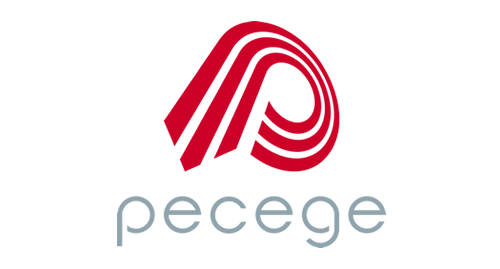

<h1 align="center"> Pecege Code Challenge </h1>

<p align="center">
  
  <br>
</p>


<p align="center">
  <a href="#📋-sobre">📋 Sobre</a>&nbsp;&nbsp;&nbsp;|&nbsp;&nbsp;&nbsp;
  <a href="#🚀-tecnologias">🚀 Tecnologias</a>&nbsp;&nbsp;&nbsp;|&nbsp;&nbsp;&nbsp;
  <a href="#⚙-como-rodar">⚙ Como Rodar</a>&nbsp;&nbsp;&nbsp;|&nbsp;&nbsp;&nbsp;
  <a href="#🌐-endpoints">🌐 Endpoints</a>&nbsp;&nbsp;&nbsp;|&nbsp;&nbsp;&nbsp;
  <a href="#📝-license">📝 License</a>
</p>

## 📋 Sobre

Este desafio consiste na criação de uma API REST utilizando Python, Django e Django Rest Framework. O objetivo é desenvolver um sistema de gerenciamento de pessoas, por meio do processamento de planilhas.


## 🚀 Tecnologias

Esse projeto foi desenvolvido com as seguintes tecnologias:

- [Python](https://www.python.org/)
- [Django](https://www.djangoproject.com/)
- [Django Rest Framework](https://www.django-rest-framework.org/)
- [MySQL](https://www.mysql.com/)
- [Docker](https://www.docker.com/)
- [Swagger](https://swagger.io/)

## ⚙ Como Rodar

### 1. Dependências

Primeiramente, você vai precisar ter o [Docker]((https://www.docker.com/)) e o [docker-compose](https://docs.docker.com/compose/install/) instalados na sua máquina.

### 2. Baixando Repositório

```bash
$ git clone git@github.com:pedro-prp/pecege-code-challenge.git

$ cd pecege-code-challenge
```

### 3. Iniciando a aplicação

Para configurar as variáveis de ambiente, basta rodar o comando:
```bash
cp .env.example .env
```

Antes de rodar a aplicação, também é importante garantir as permissões do arquivo de entrypoint, com o seguinte comando:
```bash
chmod +x entrypoint.sh
```


E para iniciar a aplicação, basta rodar o seguinte comando:

```bash
$ docker-compose up
```

O próprio docker-compose vai se encarregar de criar o banco de dados, rodar as migrações e iniciar o servidor.
Além disso, o docker-compose vai criar um usuário admin com as seguintes credenciais:
```bash
    username: admin
    password: admin
```

E ainda vai carregar alguns dados iniciais para a aplicação. Tudo isso ocorre devido ao arquivo de entrypoint `django.sh` que é executado quando o container é iniciado.

### 4. Acessando a aplicação

Com a aplicação rodando, você tem acesso aos seguintes links:

| Nome           | Link                             | Descrição |
|----------------|----------------------------------|-----------|
| API Swagger    | http://localhost:8000/swagger/   | O Swagger é uma estrutura para projetar, criar e documentar APIs de forma eficiente, usando o formato JSON ou YAML. Ele simplifica o desenvolvimento e o consumo de APIs, fornecendo documentação interativa e a capacidade de gerar clientes SDK em várias linguagens de programação. |
| Admin          | http://localhost:8000/admin/     | O Django admin é uma interface de administração pronta e personalizável do Django para gerenciar dados do aplicativo sem escrever código adicional.  |
| Redoc          | http://localhost:8000/redoc/     | O Redoc é uma ferramenta que gera documentação interativa para APIs com base na especificação OpenAPI, facilitando a compreensão e integração com a API. |

## 🌐 Endpoints

A aplicação possui os seguintes endpoints:


### 1. API de Planilhas(spreadsheets)
| Método | Endpoint          | Descrição                           |
|--------|-------------------|-------------------------------------|
| GET    | /upload-planilha/   | Processa a planilha enviada e retorna as pessoas ativas, além de salvar os mesmos no banco de dados |
| POST   | /download-planilha/ | Retorna as pessoas ativas no banco de dados no formato de Planilha(.xlsx)                           |

## 📝 License

Esse projeto está sob a licença MIT. Veja o arquivo [LICENSE](LICENSE) para mais detalhes.